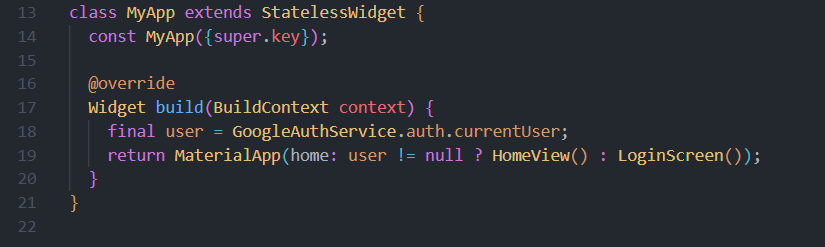

Google Sign-In Setup

To enable Google Sign-In in this Flutter project, follow these steps:

1. Create Firebase Project

Create a new project from Firebase Console:
https://console.firebase.google.com/

2. Add Android App

Add your Android app in Firebase using the same package name of your Flutter project.

3. Enable Google Sign-In

Go to:
Firebase Console → Authentication → Sign-in method → Google → Enable

4. Add SHA-1 Fingerprint

Copy the SHA-1 and add it in:
Firebase Console → Project Settings → Your Android App → SHA certificate fingerprints

5. Download google-services.json

Download the updated google-services.json file and place it in:

android/app/google-services.json

6. Configure Android Project

Add the Google Services classpath in android/build.gradle:

plugins {
    id("com.google.gms.google-services") version "4.4.2" apply false
}

In android/app/build.gradle:

id("com.google.gms.google-services")

7. Add Required Dependencies

Add the following packages in pubspec.yaml:

dependencies:
  firebase_core: ^4.9.0
  firebase_auth: ^6.5.1
  google_sign_in: ^6.2.1

Then run:

flutter pub get

8. Implement Sign-In Logic

Use Firebase Auth with Google Sign-In to authenticate the user and create a session.

9. Run the App
flutter run

=> The application checks if the user is already authenticated when the app starts.

If a user session exists → the user is redirected to the Home Screen.
If no session exists → the Login Screen is shown.

